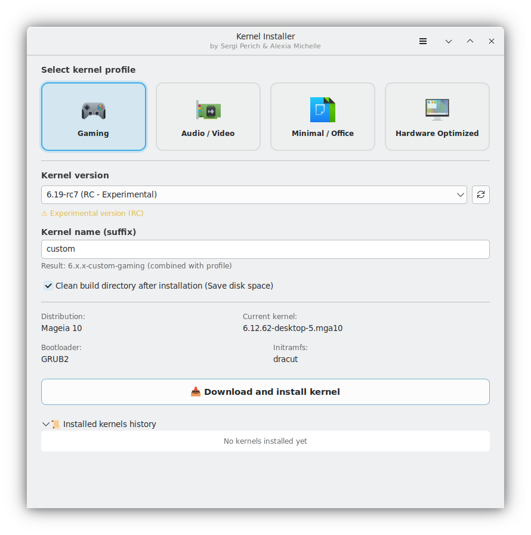
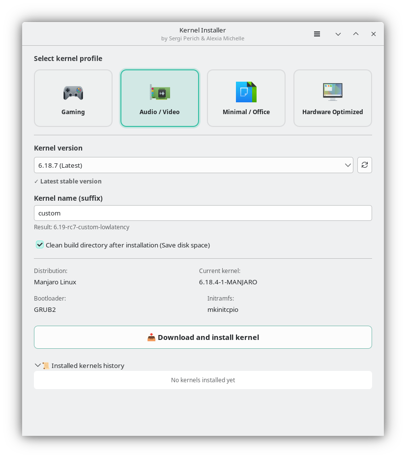
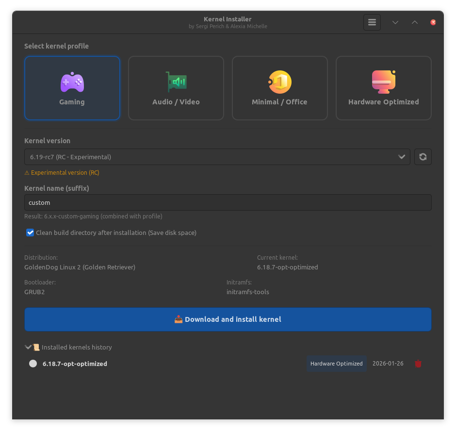
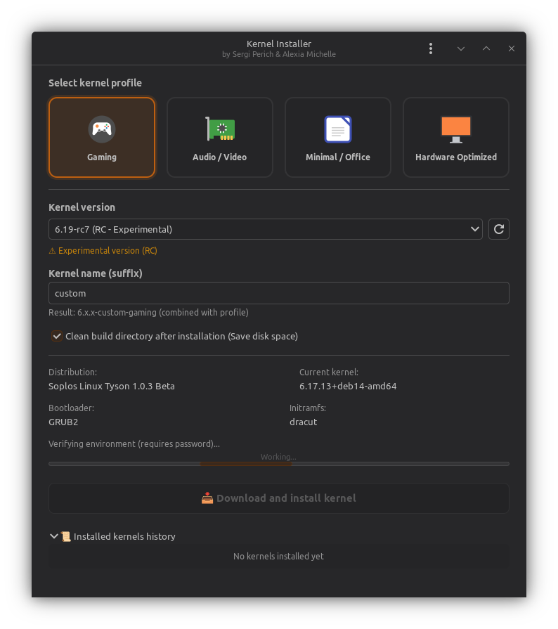

# Kernel Installer

A graphical interface for downloading, compiling, and installing the Linux kernel with optimized profiles.


## Preview






## Authors

- **Sergi Perich** <info@soploslinux.com>
- **Alexia Michelle** <alexia@goldendoglinux.org>

## Features

- Download kernels directly from kernel.org (stable, LTS, RC)
- Optimized profiles: Gaming, Audio/Video, Minimal, Hardware Optimized
- Auto-detection of Hardware features (CPU, GPU, NVMe) for performance
- Virtualization support detection (QEMU, VMware, VirtualBox)
- **Multi-distro support**:
  - **Debian Family**: Debian, Soplos, GoldenDog, LMDE, Ubuntu, Kubuntu, Xubuntu, Lubuntu, Linux Mint, Pop!\_OS, MX Linux, Elementary OS, Kali Linux.
  - **Arch Family**: Arch Linux, Manjaro, EndeavourOS, CachyOS, Garuda Linux.
  - **Fedora Family**: Fedora, Red Hat Enterprise Linux, CentOS Stream, AlmaLinux, Rocky Linux.
  - **Mageia Family**: Mageia, OpenMandriva, Rosa Linux, PCLinuxOS.
- Single sudo prompt for the entire installation process
- Fluent reboot without extra password prompts (integrated with systemd)
- Optional automatic cleanup of build directory
- Real-time system load monitoring with descriptive labels and tooltips
- Auto-detection of bootloader (GRUB, systemd-boot, rEFInd)
- Auto-detection of initramfs tool (dracut, initramfs-tools, mkinitcpio)
- Custom kernel naming
- Desktop notifications (transient via libnotify, auto-hide after 5s)
- **Universal localization**: 100% translation coverage for 8 languages (EN, ES, FR, PT, DE, IT, RO, RU)
- **Compact UI**: Redesigned and optimized interface for various screen sizes
- **Major build optimization**: Automatically disables `CONFIG_DEBUG_INFO` to speed up compilation by ~50%
- Intelligent automated system dependency verification and installation
- Improved build cancellation: smart detection and user-friendly notifications
- Kernel removal support for Debian, Ubuntu, Arch, Fedora, and Mageia families

## Requirements

- Python 3.10+
- GTK 3.0
- PyGObject

### Debian/Ubuntu

```bash
sudo apt install python3-gi python3-gi-cairo gir1.2-gtk-3.0 gir1.2-notify-0.7
```

### Fedora / RHEL / Alma / Rocky

```bash
sudo dnf install python3-gobject gtk3
```

### Arch / Manjaro / Endeavour / Cachy / Garuda

```bash
sudo pacman -S python-gobject gtk3
```

### Mageia / OpenMandriva / Rosa / PCLOS

```bash
# In Mageia (use urpmi for best results with architecture naming)
sudo urpmi python3-gi lib64gtk+3.0_0
```

## 📦 Installation

### Option 1: Native Packages (Recommended)

- **Debian/Ubuntu/Mint**: [Download .deb](https://github.com/SoplosLinux/kernel-installer/releases)
  ```bash
  sudo dpkg -i kernel-installer_1.0.2_all.deb
  sudo apt install -f
  ```
- **Arch Linux/Manjaro**:
  ```bash
  cd packaging/arch
  makepkg -si
  ```
- **Fedora/RHEL**:
  ```bash
  sudo dnf install kernel-installer-1.0.2-fedora.noarch.rpm
  ```
- **Mageia/Mandriva**:
  ```bash
  sudo urpmi kernel-installer-1.0.2-mageia.noarch.rpm
  ```

### Option 2: From Source

1. Clone the repository:
   ```bash
   git clone https://github.com/SoplosLinux/kernel-installer.git
   ```
2. Install dependencies (see Requirements)
3. Run the program:
   ```bash
   python3 main.py
   ```

## Keyboard Shortcuts

| Shortcut | Action           |
| -------- | ---------------- |
| Ctrl+Q   | Quit             |
| F5       | Refresh versions |

## License

GPL-3.0 - See [LICENSE](LICENSE)

## Links

- [GitHub Repository](https://github.com/SoplosLinux/kernel-installer)
